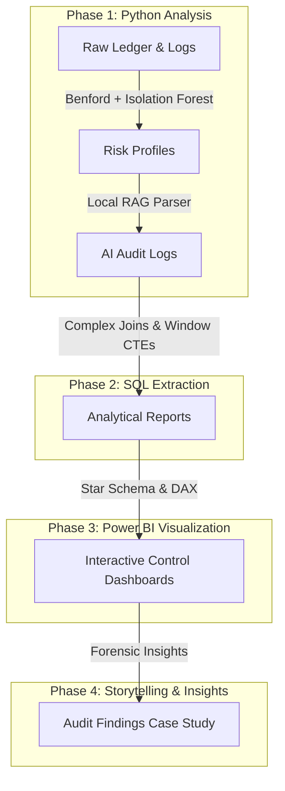

# Forensic Case Study: Zenith Command Center (SDE/DS/DA/BTSA Portfolio)

This case study outlines the architectural design and operations of the Zenith platform, structured into **4 Clear Phases** optimized for technical portfolio reviews and hiring manager panel presentations.



---

## Phase 1: Python for Analysis (Forensic Modeling & RAG)

This phase establishes the analytical engine of the system, combining unsupervised machine learning, statistical models, and semantic retrieval to flag and audit anomalies.

### 1. Digits Frequency Analysis (Benford's Law)
*   **Concept**: Naturally occurring financial numbers follow a logarithmic distribution where smaller digits (1, 2, 3) are much more common leading digits than larger numbers (8, 9).
*   **Math**: The probability of a leading non-zero digit $d$ is:
    $$P(d) = \log_{10}\left(1 + \frac{1}{d}\right)$$
*   **Python Execution**: [src/anomaly_detector.py](file:///Users/vinayakbhat/.gemini/antigravity/scratch/zenith-financial-intelligence/src/anomaly_detector.py) extracts the leading digit of transaction amounts and builds a historical digit profile for each user. If a user's transaction digit distribution deviates significantly from Benford's expected percentages, a deviation index is calculated.

### 2. Multi-Dimensional Anomaly Isolation (Isolation Forest)
*   **Concept**: Standard rule engines miss complex, multi-variable fraud patterns. Zenith utilizes an unsupervised **Isolation Forest** model to isolate outliers.
*   **Features Processed**:
    *   `log_amount`: Log-scale representation of absolute debit/credit values.
    *   `posting_hour`: Hour of transaction (derived from timestamp logs).
    *   `day_of_week`: Identifying weekend vs. weekday transactions.
    *   `is_manual_override`: Flag indicating bypass of system approvals.
    *   `is_sod_violation`: Binary indicator if the poster matches the transaction approver.
*   **Python Execution**: Fits an `IsolationForest(contamination=0.03)` model on the scaled features, assigning a standardized risk index (0-100%) to each transaction.

### 3. Compliance Policy Semantic Matching (Local RAG)
*   **Concept**: When anomalies are flagged, the platform must explain *why* they represent compliance violations.
*   **Python Execution**: [src/local_rag.py](file:///Users/vinayakbhat/.gemini/antigravity/scratch/zenith-financial-intelligence/src/local_rag.py) implements a lightweight vector database using TF-IDF and Cosine Similarity to query corporate policy rules.
*   **Agentic Decisioning**: [src/audit_agent.py](file:///Users/vinayakbhat/.gemini/antigravity/scratch/zenith-financial-intelligence/src/audit_agent.py) takes the flagged outlier data and queries the local vector store for the violated policy clause. The payload is passed to a GPT-4o-mini agent to generate a CPA-grade compliance report explaining the incident.

---

## Phase 2: SQL for Data Extraction (The Analytical Warehouse)

This phase transforms raw ledger logs into structured, analytical models in the data warehouse, preparing metrics for BI dashboard consumption.

### 1. Separation of Duties (SoD) Violations Extract
Finds transactions where a user posted and approved their own general ledger changes (violating internal control laws):
```sql
SELECT 
    fje.entry_id,
    fje.transaction_date,
    fje.posted_by,
    fje.approved_by,
    da.account_code,
    (fje.debit_amount + fje.credit_amount) AS transaction_amount,
    fje.risk_score
FROM fact_journal_entries fje
JOIN dim_accounts da ON fje.account_key = da.account_key
WHERE fje.posted_by = fje.approved_by 
  AND (fje.debit_amount > 0 OR fje.credit_amount > 0)
ORDER BY transaction_amount DESC;
```

### 2. Transaction Splitting Detection
Uses Common Table Expressions (CTEs) to find cases where an operator split a transaction into smaller amounts on the same day to bypass approval thresholds:
```sql
WITH daily_postings AS (
    SELECT 
        DATE(transaction_date) AS post_date,
        posted_by,
        account_key,
        COUNT(DISTINCT entry_id) AS split_count,
        SUM(debit_amount + credit_amount) AS total_daily_value,
        GROUP_CONCAT(entry_id) AS split_entry_ids
    FROM fact_journal_entries
    WHERE (debit_amount + credit_amount) < 5000.0 -- Corporate limit
      AND (debit_amount + credit_amount) > 0
    GROUP BY post_date, posted_by, account_key
)
SELECT dp.post_date, dp.posted_by, da.account_name, dp.split_count, dp.total_daily_value
FROM daily_postings dp
JOIN dim_accounts da ON dp.account_key = da.account_key
WHERE dp.split_count >= 3;
```

### 3. Off-Hours & Weekend Activity Extraction
Finds manual transactions posted outside core working hours (9 AM - 6 PM) or on weekends:
```sql
SELECT 
    fje.entry_id,
    fje.transaction_date,
    fje.posted_by,
    (fje.debit_amount + fje.credit_amount) AS amount,
    STRFTIME('%H', fje.transaction_date) AS posting_hour,
    STRFTIME('%w', fje.transaction_date) AS day_of_week
FROM fact_journal_entries fje
JOIN dim_users du ON fje.user_key = du.user_key
WHERE du.user_id <> 'usr_admin' -- Exclude automated system tasks
  AND (
      STRFTIME('%H', fje.transaction_date) < '09' 
      OR STRFTIME('%H', fje.transaction_date) >= '18'
      OR STRFTIME('%w', fje.transaction_date) IN ('0', '6')
  )
ORDER BY transaction_date DESC;
```

---

## Phase 3: Power BI for Visualization (The Enterprise Command Center)

This phase establishes the semantic model and interface in Power BI, enabling interactive forensic investigations.

### 1. Star Schema Relational Data Model
The model is structured around a central fact table joined to dimension tables via 1-to-many relationships:
*   `fact_journal_entries` [*] $\rightarrow$ `dim_accounts` [1] (Account lookup)
*   `fact_journal_entries` [*] $\rightarrow$ `dim_entities` [1] (Subsidiary lookup)
*   `fact_journal_entries` [*] $\rightarrow$ `dim_users` [1] (User lookup)
*   `fact_journal_entries` [1] $\rightarrow$ `fact_audit_log` [0/1] (AI audit check detail)

### 2. Core DAX Calculations

#### Total Ledger Value
```dax
Total Ledger Value = SUM(fact_journal_entries[debit_amount])
```

#### Average Anomaly Risk
```dax
Average Risk = AVERAGE(fact_journal_entries[risk_score])
```

#### Anomaly Value Ratio (Proportion of budget affected by flagged entries)
```dax
Anomaly Value Ratio = 
VAR FlaggedValue = 
    CALCULATE(
        [Total Ledger Value],
        fact_journal_entries[risk_score] > 70
    )
VAR TotalVal = [Total Ledger Value]
RETURN
    DIVIDE(FlaggedValue, TotalVal, 0)
```

---

## Phase 4: Business Insights & Storytelling (Case Study)

Below are three specific fraud incidents identified by Zenith during the historical analysis of the generated ledger database:

### Case 1: The Self-Approved Software Assets
*   **The Anomaly**: An operator named `usr_amit` posted a transaction of **$19,984.98** to a Cash Account and approved it himself. 
*   **How it was caught**: The Isolation Forest model flagged the entry with a **100% Risk Score** because the poster and approver matched (SoD violation), and it was a manual override.
*   **The AI RAG audit outcome**: The agent matched the transaction to SoD Rule 101, flagging it as `SUSPICIOUS` and logging a warning: *"Severe Separation of Duties violation. Transaction of $19,984.98 approved by the poster (usr_amit). Immediate audit escalation required."*

### Case 2: The Under-the-Threshold IT Splitting Scheme
*   **The Anomaly**: A series of three transactions of **$4,999.00** were posted to a Software Subscription account within minutes of each other on February 15th by `usr_john`.
*   **How it was caught**: The SQL Splitting query caught the entries because three identical amounts just below the $5,000 threshold were posted to the same account on the same day.
*   **The AI RAG audit outcome**: The auditor flagged it as `SUSPICIOUS` under Rule 102, identifying transaction splitting to bypass manager approvals.

### Case 3: The Off-Hours Expense Override
*   **The Anomaly**: A transaction of **$8,500.00** was posted to a Travel Expense account at 2:45 AM on a weekend by `usr_sarah`.
*   **How it was caught**: The Isolation Forest model flagged it due to the time and date features, and the SQL Off-Hours query isolated the manual weekend timestamp.
*   **The AI RAG audit outcome**: The agent flagged the entry as `AUDIT_REQUIRED` under Rule 103, recommending retrospective documentation checks for the night-time booking.
